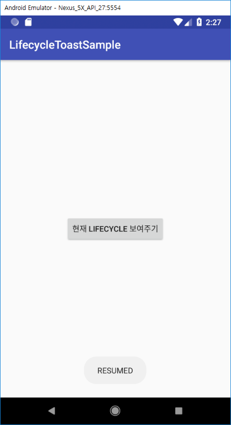

# Android Architecture Components - Lifecycle
Android Architecture Componenets(이하 AAC)의 컴포넌트 중 하나이며 Activity와 Fragment의 생명주기를 훨씬 쉽게 관리할 수 있도록 도와준다.
또한 AAC에서 다른 컴포넌트들이 `Lifecycle`과 연동되어 작동하기 때문에 AAC에서도 상당히 핵심적인 부분이다.
중요도에 비해서 러닝커브가 높은 것도 아니고 쓰기가 어려운 수준도 아니다.
안드로이드 프로젝트를 만들면 포함되는 `appcompat-v7` support 라이브러리에서 해당 `Lifecycle`를 의존하고 있기 때문에 따로 빌드파일을 설정해 줄 필요도 없다.

안드로이드에서는 각 Activity가 소멸될 때 다른 자원들도 같이 GC를 통해 풀어줘야 하는 경우가 많이 생긴다.
그리고 그 자원들이 Activity와 같은 생명주기를 직접적으로 다룰 수 있는 곳에서라면 생명주기 관련 메서드를 오버라이딩하여 자원을 풀어줄 수 있다. 
그러나 다른 클래스에서는 생성자로 activity를 넘겨서 Delegation 패턴을 사용하던지 어떻게든 간접적으로 생명주기를 관리해주는 **복잡**하고 **반복**적인 코드를 써야 한다.
게다가 이렇게 넘어간 activity는 `onDestroy()`가 호출될 때 자원을 해제하기 위하여 보통 멤버변수로 저장하는데 해당 클래스 인스턴스가 소멸되지 않으면 activity도 멤버변수로 남아있어서 엄청난 메모리 누수를 일으킨다. (안드로이드가 알림창에 해당 앱이 메모리를 너무 많이 쓴다고 유저에게 알려준다.)

조금 더 자세한 내용은 아래 페이지에서 찾아볼 수 있다.
- 공식문서 : https://developer.android.com/topic/libraries/architecture/lifecycle
- Realm AAC 소개 : https://academy.realm.io/kr/posts/android-architecture-components-and-realm/


# Lifecycle 예제 만들기
아래에서 만들어볼 것은 다른 클래스에서 Activity의 Lifecycle을 구독하고 있다가 lifecycle 상태가 변경되면 Toast 메세지를 띄워주는 간단한 예제이다.
또한 Activity에 있는 버튼을 누르면 현재 Activity의 상태를 Toast 메세지로 보여줄 것이다.


## 1. 프로젝트 생성


추가적으로 현재 기준으로 프로젝트 생성시 suupport library가 beta버전이므로 27로 다운그레이드 한다.
````gradle
android {
    // compileSdkVersion 28
    compileSdkVersion 27
 
    defaultConfig {
        // targetSdkVersion 28
        targetSdkVersion 27
        // ....
    }
}
 
dependencies {
    // implementation 'com.android.support:appcompat-v7:28.0.0-beta01'
    implementation 'com.android.support:appcompat-v7:27.1.1'
}
````

AAC의 `Lifecycle`을 쓰려면 따로 의존성 추가 필요없이 `support library`만 있으면 된다.
dependency tree는 다음과 같다.

````bash
$ ./gradlew app:dependencies

# =================== 생략 =======================
+--- com.android.support:appcompat-v7:27.1.1
|    +--- com.android.support:support-annotations:27.1.1
|    +--- com.android.support:support-core-utils:27.1.1
|    |    +--- com.android.support:support-annotations:27.1.1
|    |    \--- com.android.support:support-compat:27.1.1
|    |         +--- com.android.support:support-annotations:27.1.1
|    |         \--- android.arch.lifecycle:runtime:1.1.0
|    |              +--- android.arch.lifecycle:common:1.1.0
|    |              \--- android.arch.core:common:1.1.0
|    +--- com.android.support:support-fragment:27.1.1
|    |    +--- com.android.support:support-compat:27.1.1 (*)
|    |    +--- com.android.support:support-core-ui:27.1.1
|    |    |    +--- com.android.support:support-annotations:27.1.1
|    |    |    +--- com.android.support:support-compat:27.1.1 (*)
|    |    |    \--- com.android.support:support-core-utils:27.1.1 (*)
|    |    +--- com.android.support:support-core-utils:27.1.1 (*)
|    |    +--- com.android.support:support-annotations:27.1.1
|    |    +--- android.arch.lifecycle:livedata-core:1.1.0
|    |    |    +--- android.arch.lifecycle:common:1.1.0
|    |    |    +--- android.arch.core:common:1.1.0
|    |    |    \--- android.arch.core:runtime:1.1.0
|    |    |         \--- android.arch.core:common:1.1.0
|    |    \--- android.arch.lifecycle:viewmodel:1.1.0
|    +--- com.android.support:support-vector-drawable:27.1.1
|    |    +--- com.android.support:support-annotations:27.1.1
|    |    \--- com.android.support:support-compat:27.1.1 (*)
|    \--- com.android.support:animated-vector-drawable:27.1.1
|         +--- com.android.support:support-vector-drawable:27.1.1 (*)
|         \--- com.android.support:support-core-ui:27.1.1 (*)
# =================== 생략 =======================
````

## 2. `activity_main.xml`에 버튼 넣기
````xml
<android.support.constraint.ConstraintLayout
    xmlns:android="http://schemas.android.com/apk/res/android"
    xmlns:app="http://schemas.android.com/apk/res-auto"
    xmlns:tools="http://schemas.android.com/tools"
    android:layout_width="match_parent"
    android:layout_height="match_parent"
    tools:context=".MainActivity"
    >

    <Button
        android:id="@+id/btnLifecycle"
        android:layout_width="wrap_content"
        android:layout_height="wrap_content"
        android:text="현재 Lifecycle 보여주기"
        app:layout_constraintBottom_toBottomOf="parent"
        app:layout_constraintLeft_toLeftOf="parent"
        app:layout_constraintRight_toRightOf="parent"
        app:layout_constraintTop_toTopOf="parent"
        />

</android.support.constraint.ConstraintLayout>
````

## 3. MainActivity에 showCurrentLifecycle() 함수 추가하기
````kotlin
class MainActivity : AppCompatActivity() {

    override fun onCreate(savedInstanceState: Bundle?) {
        super.onCreate(savedInstanceState)
        setContentView(R.layout.activity_main)
    }

    fun showCurrentLifecycle() {
        Toast.makeText(this, lifecycle.currentState.name, Toast.LENGTH_SHORT).show()
    }
}
````

## 4. 버튼에 setOnClickListener()를 통해 토스트 메세지 출력하기
````kotlin
override fun onCreate(savedInstanceState: Bundle?) {
    super.onCreate(savedInstanceState)
    setContentView(R.layout.activity_main)

    btnLifecycle.setOnClickListener { showCurrentLifecycle() }
}
````

여기까지 한 다음 에뮬레이터를 통해 어플리케이션을 돌려보면 다음과 같다.


버튼을 클릭했을 때는 아래와 같다.




## 5. MVP 구조 만들기 (생략 가능)
> Lifecycle의 진정한 장점은 다른 클래스가 생명주기에 관여할 일이 생길 때부터이다.
굳이 MVP 구조로 가고 싶지 않다면 단순히 로그를 띄우는 클래스를 만드는 정도로 해당 단계를 건너 뛸 수 있다.  

MainPresenter는 MainActivity의 생명주기를 관찰하면서 생명주기가 바뀔 때마다 토스트 메세지를 띄우라고 명령할 클래스이다.  
MainPresenter를 만들기에 앞서 MainContract를 만든다.

````kotlin
interface MainContract {
    interface View
    interface Presenter
}
````

그리고 MainActivity에게 View를 상속받게 만든다.

````kotlin
class MainActivity : AppCompatActivity(), MainContract.View
````


`MainActivity.showCurrentLifecycle()`을 View 인터페이스에 정의한다음 오버라이딩 한다.
````kotlin
interface MainContract {
    interface View {
        fun showCurrentLifecycle()
    }

    interface Presenter
}

class MainActivity : AppCompatActivity(), MainContract.View {
    override fun showCurrentLifecycle() {
        Toast.makeText(this, lifecycle.currentState.name, Toast.LENGTH_SHORT).show()
    }
}
````

## 6. MainPresenter 만들기
MainContract.Presenter에 LifecycleObserver를 상속받게 하고 MainPresenter에서 MainContract.Presenter를 상속한다.
> MainPresenter에서 직접 상속받고 MainActivity에서 타입을 MainContract.Presenter가 아닌 MainPresenter로 바꾸어도 된다.

<!-- TODO: Presenter에 라이프 사이클 관련 설명 추가 -->

````kotlin
interface MainContract {
    interface View {
        fun showCurrentLifecycle()
    }

    interface Presenter : LifecycleObserver
}

class MainActivity : AppCompatActivity(), MainContract.View {
    private lateinit var presenter: MainContract.Presenter

    override fun onCreate(savedInstanceState: Bundle?) {
        // ...
        presenter = MainPresenter(this)
        lifecycle.addObserver(presenter)
    }
}

class MainPresenter(
    view: MainContract.View
) : MainContract.Presenter {
}
````