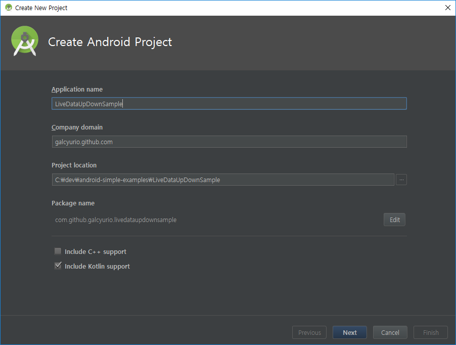
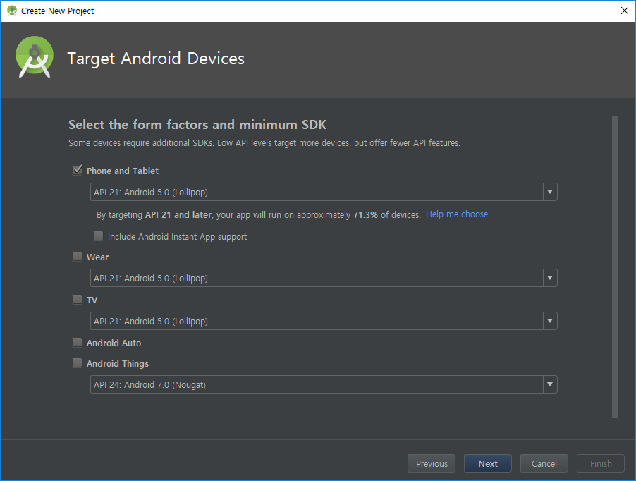
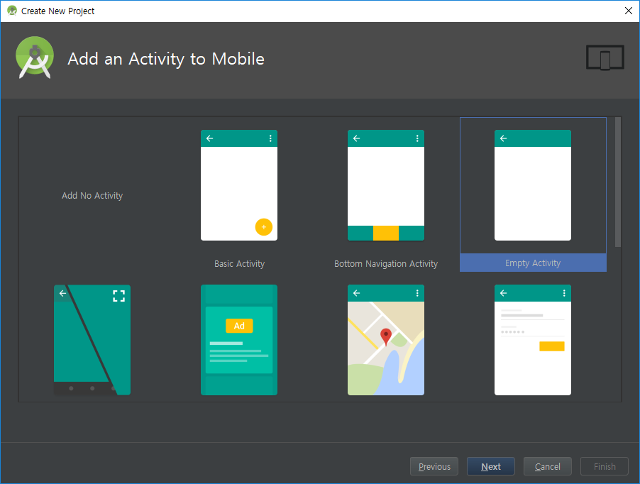
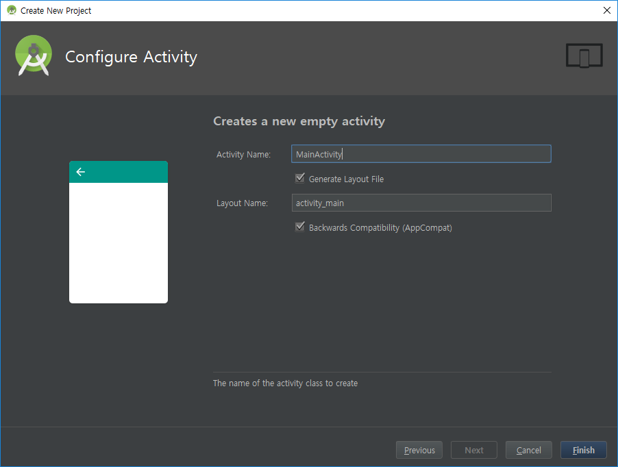
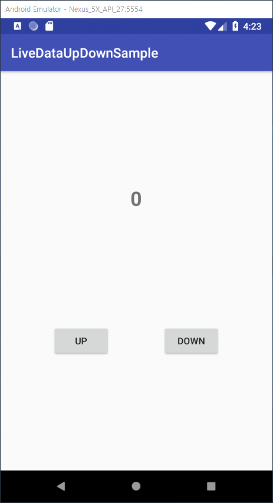

# Android Architecture Components - LiveData
> `LiveData` is an observable data holder class.

`LiveData`는 lifecycle과 연동되는 `lifecycle-aware` 컴포넌트 중 하나이며 다음은 공식문서에서 장점으로 소개하는 것들이다.

- UI와 데이터의 상태를 일치하는지 확인
  - LiveData는 옵저버 패턴을 따르며 Observer들에게 데이터의 상태가 변경되면 바로 알려주기 때문에 UI를 업데이트 하는 코드를 쓰지 않아도 Observer가 변경될 때마다 UI를 업데이트 해준다.

- 메모리 누수 방지
  - LiveData는 Lifecycle과 바인딩되어서 lifecycle이 destroy 상태가 되면 자체적으로 데이터를 정리한다.

- ON_STOP 상태가 된 Activity로 인한 Crash가 없음
  - Activity가 back stack으로 가는 경우처럼 observer의 lifecycle이 비활성화 되었을 때 LiveData 로부터 어떠한 이벤트도 전달받지 않는다.
  - (추가) 만약 이벤트를 전달받게 되면 자동으로 UI를 업데이트하기 때문에 activity가 죽었으니 업데이트할 UI가 없어서 Crash가 일어난다.

- 수동으로 해주었던 생명주기 관리가 필요없음
  - UI 컴포넌트들은 관련된 LiveData를 구독을 해제하거나 중지할 필요없이 그저 구독을 시작하기만 하면 된다.
  - LiveData가 자동으로 lifecycle 변경에 따라서 구독을 해제하는 등의 작업을 수행한다.
  
- 항상 최신 데이터로 유지됨
  - 만약 lifecycle이 비활성 상태가 되면 다시 활성화 될 때 최신의 데이터를 받아온다.
  - 예를 들어 Activty가 background 상태에 있었다가 foreground로 상태가 되는 경우 최신 데이터를 받아온다.

- configuration change 시에 적절한 동작
  - 디바이스 화면을 회전시키는 경우와 같이 configuration change 이벤트 때문에 Activity, Fragment가 다시 생성되는 경우 즉시 최신 데이터를 받아온다.

- 자원 공유하기
  - LiveData를 상속한 다음 싱글턴 패턴을 사용하여 `시스템 서비스`를 래핑하면 앱 내에서 자원을 공유할 수 있다.
  - 이 LiveData는 `시스템 서비스`에 단 한 번만 연결되고 해당 자원을 필요로 하는 observer들은 구독하기만 하면 된다.


조금 더 자세한 내용은 아래 페이지에서 찾아볼 수 있다.
- 공식문서 : https://developer.android.com/topic/libraries/architecture/livedata
- Realm AAC 소개 : https://academy.realm.io/kr/posts/android-architecture-components-and-realm/


# LiveData 예제 만들기
지금부터 만들어볼 예제는 화면에 `UP, DOWN 버튼 두 개`와 `숫자 텍스트뷰`가 있고 UP 버튼을 누르면 숫자가 1 올라가고 DOWN 버튼을 누르면 숫자가 1 내려가는 어플리케이션이다.  
이 예제를 통해서는 공식적으로 소개한 장점들에 대해서 몇 가지는 제대로 보여 줄 수가 없으니 참고하길 바란다. 

모든 AAC 컴포넌트를 활용한 MVVM 패턴이 적용된 공식적인 샘플은 [여기](https://github.com/googlesamples/android-architecture-components)에서 찾을 수 있다.

지금부터 만들 예제의 완성된 프로젝트는 [여기](https://github.com/galcyurio/android-simple-examples/issues/3)에서 커밋별로 확인할 수 있다.


## 1. 프로젝트 생성








프로젝트를 만들면 포함되는 `support library`에서 `livedata`에 의존하고 있기 때문에 `build.gradle`에 따로 의존성을 추가해주지 않아도 된다.


## 2. acitivty_main 레이아웃 만들기
버튼 두개와 TextView 하나가 있는 레이아웃을 만든다.

````xml
<android.support.constraint.ConstraintLayout
    xmlns:android="http://schemas.android.com/apk/res/android"
    xmlns:app="http://schemas.android.com/apk/res-auto"
    xmlns:tools="http://schemas.android.com/tools"
    android:layout_width="match_parent"
    android:layout_height="match_parent"
    tools:context=".MainActivity"
    >

    <TextView
        android:id="@+id/tvNumber"
        android:layout_width="wrap_content"
        android:layout_height="wrap_content"
        android:textSize="30sp"
        android:textStyle="bold"
        app:layout_constraintBottom_toTopOf="@id/btnUp"
        app:layout_constraintLeft_toLeftOf="parent"
        app:layout_constraintRight_toRightOf="parent"
        app:layout_constraintTop_toTopOf="parent"
        tools:text="0"
        />

    <Button
        android:id="@+id/btnUp"
        android:layout_width="wrap_content"
        android:layout_height="wrap_content"
        android:text="UP"
        app:layout_constraintBottom_toBottomOf="parent"
        app:layout_constraintLeft_toLeftOf="parent"
        app:layout_constraintRight_toLeftOf="@id/btnDown"
        app:layout_constraintTop_toBottomOf="@id/tvNumber"
        />

    <Button
        android:id="@+id/btnDown"
        android:layout_width="wrap_content"
        android:layout_height="wrap_content"
        android:text="DOWN"
        app:layout_constraintBottom_toBottomOf="parent"
        app:layout_constraintLeft_toRightOf="@id/btnUp"
        app:layout_constraintRight_toRightOf="parent"
        app:layout_constraintTop_toBottomOf="@id/tvNumber"
        />

</android.support.constraint.ConstraintLayout>
````

## 3. NumberViewModel 만들기
LiveData는 AAC의 ViewModel 컴포넌트와 같이 쓰면 좋지만 `configuration change`(화면 회전) 이벤트가 발생하면 어떻게 되는지를 보기 위하여 적용시키지 않는다.


````kotlin
class MainActivity : AppCompatActivity() {
    private lateinit var viewModel: NumberViewModel

    override fun onCreate(savedInstanceState: Bundle?) {
        super.onCreate(savedInstanceState)
        setContentView(R.layout.activity_main)

        viewModel = NumberViewModel()
    }
}

class NumberViewModel {
    
}
````

## 4. `NumberViewModel`에 숫자를 저장하는 LiveData 멤버 변수와 plus, minus 함수 추가하기
가장 초기에는 값이 없을테니 0으로 초기화 시켜준다.

> 여기서 짚고 넘어가야 할 것은 `NumberViewModel`이 만약 사라졌다가 다시 생성되면 이전 값이 뭐가 되었든 0으로 초기화 된다는 점이다.  
현재 MainActivity가 생성되고 소멸될 때 같이 NumberViewModel도 생성되고 소멸된다. 기억하고 넘어가자.

````kotlin
class NumberViewModel {
    val number = MutableLiveData<Int>().apply { value = 0 }

    fun plus() {
        number.value = number.value?.plus(1)
    }

    fun minus() {
        number.value = number.value?.minus(1)
    }
}
````

## 5. UP, DOWN 버튼을 누르면 LiveData에 있는 숫자가 바뀌도록 처리
`Button#setOnClickListener()`을 통해 viewModel의 함수를 호출한다.
````kotlin
btnUp.setOnClickListener { viewModel.plus() }
btnDown.setOnClickListener { viewModel.minus() }
````

## 6. LiveData를 구독하여 숫자가 바뀌면 TextView가 해당 숫자로 업데이트하게 만들기
````kotlin
viewModel.number.observe(this, Observer {
    tvNumber.text = it?.toString()
})
````


## 7. 실행
여기까지 하고 앱을 실행시켜 보면 다음과 같이 보일 것이다.




이제 UP, DOWN 버튼을 눌러보면 텍스트뷰가 바로바로 바뀌는 것을 볼 수 있을 것이다.  

---------------------------------------------------------------

추가적으로 해볼 것이 남아있다.  
적당히 0에서 더하기나 빼기를 해서 0 이외의 숫자를 만든 뒤에 화면을 돌려보자.  
아쉽게도 0으로 초기화 되는 모습을 볼 수 있다.

위에서 공식문서에서 언급한 부분은 configuration change 시에 최신의 데이터를 받아온다는 것이지 데이터를 유지한다는 것이 아니니 주의하자.

참고로 해당 이슈를 해결하려면 전통적으로 다음과 같은 방법들이 있다.

1. 화면 회전을 못하게 막기
    - 추가적인 이점으로 가로방향의 디자인을 생각하지 않아도 된다.
2. 매니페스트 파일에서 `android:configChanges` 속성 건드리기
3. `onSavedInstanceState()`를 이용해서 저장하고 복구하기
    - 관련된 유틸 라이브러리들이 있다.

위와 같은 방법 이외에 구조적으로 MVP, MVVM, MVI 디자인 패턴 적용을 도와주는 라이브러리를 활용하면 따로 신경쓰지 않아도 내부적으로 자동으로 처리해준다.

AAC 에서는 해당 이슈를 `ViewModel` 컴포넌트를 통해서 해결한다.