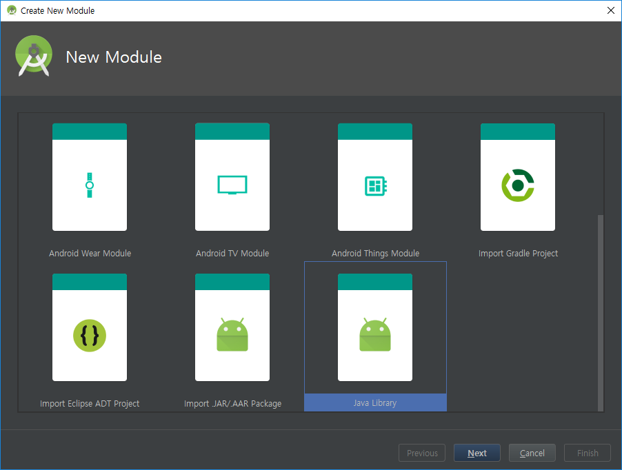
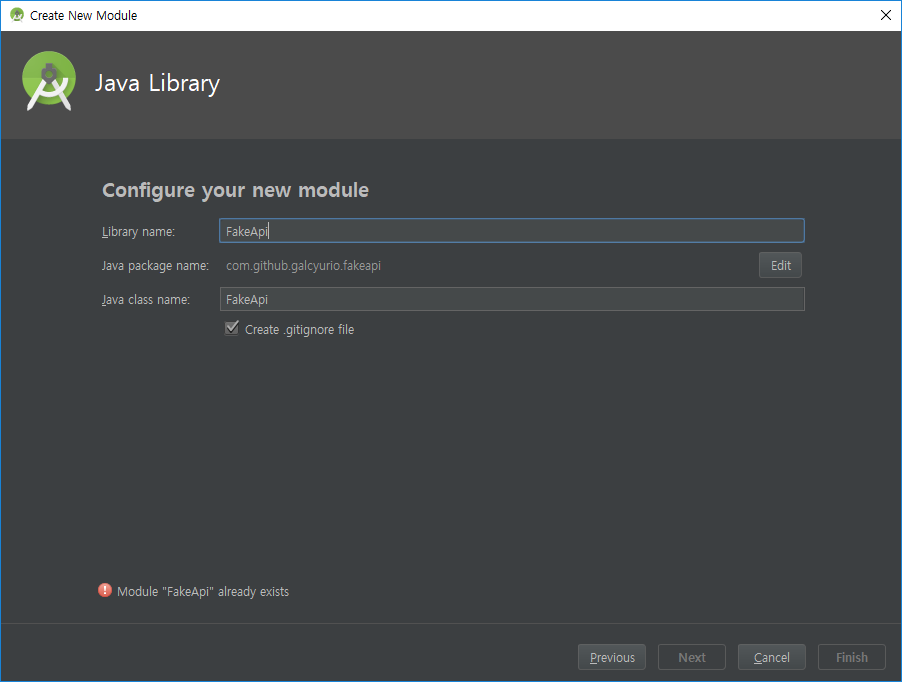

# 안드로이드의 모듈
안드로이드에서 모듈화를 하는 것을 굉장히 중요하다. 
디자인과 로직의 분리라던가 느슨한 결합의 달성, 그로인한 코드의 재사용성 증가와 같은 이점도 있지만 가장 큰 이점은 **빌드 시간의 단축**이다.
안드로이드는 최근 `android-gradle-plugin` 3.0 버전 이후부터 `compile`이라는 configuration(이하 구성)을 `api`와 `implementation`으로 2개의 구성으로 나누었다.

[공식문서 - 새로운 종속성 구성 사용](https://developer.android.com/studio/build/gradle-plugin-3-0-0-migration?hl=ko#new_configurations)

현재 기준으로 안드로이드 스튜디오를 이용하여 안드로이드 프로젝트를 생성하면 기본적으로 `implementation`이라는 구성을 사용하는 걸 찾아볼 수 있다.
두 가지로 나눔으로 인한 이점은 구글링을 통해 쉽게 자세한 내용을 찾아 볼 수 있으니 여기서는 짧게만 언급한다.

1. **모듈을 만들 때 `compile` 대신에 `api`, `implementation`으로 나누어 쓰면 멀티 모듈 프로젝트 구조에서 빌드 시간을 크게 줄일 수 있다.**

2. **`api`는 기존 `compile`과 똑같다.**

이전 안드로이드 프로젝트에서는 모듈화를 하더라도 모듈하나라도 변경이 되면 모든 모듈을 다시 빌드하기 때문에 빌드시간이 오래 걸렸다.
`assembleRelease` 또는 `assembleDebug` 명령 기준으로 APK 빌드 타임이 짧으면 5~10분이고 길면 30분까지도 걸린다.
물론 현재도 모듈화를 하지 않는다면 오래 걸리는 건 마찬가지다.

모듈화를 통한 빌드 시간 감소에 관련된 글은 [여기](https://medium.freecodecamp.org/how-modularisation-affects-build-time-of-an-android-application-43a984ce9968)를 참조하자.

# 모듈 만들기
지금부터 만들어볼 모듈은 Fake REST API 중 하나인 [이 곳](https://jsonplaceholder.typicode.com/)의 HTTP 요청 모듈이다.  
`안드로이드 라이브러리`가 아닌 `자바 라이브러리`로 진행할 예정이니 반드시 안드로이드 스튜디오를 이용해서 만들 필요는 없고 이클립스나 Intellij를 이용해도 좋다.  
하지만 여기서는 바로 app 모듈에 적용할 예정이니 안드로이드 스튜디오를 이용할 것이다.

완성된 모듈은 [여기](https://github.com/galcyurio/slipp-board-android)에서 찾아볼 수 있고 커밋별로 보려면 [여기](https://github.com/galcyurio/slipp-board-android/issues/8)를 클릭하면 된다.

## 1. 자바 라이브러리 만들기
안드로이드에 종속성을 가지고 있다면 안드로이드 라이브러리를 만들어야 겠지만 지금과 같이 단지 HTTP 요청만 보내는 모듈이라면 `자바 라이브러리`로 만드는 것을 추천한다.  
이제부터 만들 라이브러리는 편의상 `FakeApi` 모듈이라고 부른다.

**File -> New -> New Module**





> 위 그림에서 에러는 모듈이 이미 만들어져 있어서 발생한 에러이니 무시하자.

만약 안드로이드 프로젝트에서 만들면 자동으로 `settings.gradle` 파일에 include 까지 해줄 것이다.

## 2. 종속성 추가
필자의 라이브러리에서는 kotlin-std-lib, okhttp, retrofit, jackson, rxjava 등등의 라이브러리를 종속성으로 가지고 있지만 이 라이브러리를 사용하는 쪽에서는 RxJava만 있으면 되기 때문에 rxjava만 `compile`로 두고 나머지는 모두 `implementation`으로 감추었다.

이렇게 하면 FakeApi에서 implementation으로 설정된 의존 라이브러리들은 FakeApi를 사용하는 쪽에서 감추어져 있기 때문에 import도 안되고 사용할 수가 없다.

> implementation은 provided(compileOnly)와는 다르다.

````groovy
ext {
    versions = [
            kotlin          : '1.2.51',
            rxJava          : '2.1.14',

            okhttp          : '3.10.0',
            retrofit        : '2.4.0',
    ]

    deps = [
            kotlin             : "org.jetbrains.kotlin:kotlin-stdlib-jdk7:$versions.kotlin",
            rxJava             : "io.reactivex.rxjava2:rxjava:$versions.rxJava",

            retrofit           : "com.squareup.retrofit2:retrofit:$versions.retrofit",
            retrofitJackson    : "com.squareup.retrofit2:converter-jackson:$versions.retrofit",
            retrofitRxJava     : "com.squareup.retrofit2:adapter-rxjava2:$versions.retrofit",
    ]
}

dependencies {
    implementation deps.kotlin
    implementation deps.retrofit, deps.retrofitJackson, deps.retrofitRxJava
    compile deps.rxJava
}
````

## 3. noarg 플러그인 적용
Jackson과 같은 라이브러리 또는 일부 라이브러리에서는 데이터 클래스에 기본적으로 **매개변수가 하나도 없는 default constructor**(이하 기본 생성자)가 있어야 한다.
하지만 Kotlin은 생성자의 매개변수에 모두 초기값을 정해주어야 기본 생성자가 만들어진다.
이렇게하면 초기값으로 null을 주던지 다른 값을 통해 미리 초기화해두어야 하기 때문에 귀찮기도 하고 원하는 바가 아닐 수있다.
따라서 JetBrains사에서는 미리 compiler plugin으로 noarg-plugin을 지원한다.

적용방법은 [여기](https://www.slipp.net/wiki/pages/viewpage.action?pageId=30770676)를 참조하자.

## 4. 구현
모듈을 만드는 것에 집중하기 위해 구현체들은 자세하게 설명하지 않겠다.
해당 구현체에 대해 알아보려면 `Retrofit`, `retrofit-jackson-converter`, `retrofit-rxjava-adapter`에 관해서 알아보기 바란다.

- Misc.kt
````kotlin
internal annotation class NoArgsConstructor
````

- Post.kt
````kotlin
@NoArgsConstructor
data class Post(
    val title: String,
    val body: String = "",

    val id: Long? = 0,
    val userId: Long? = 0
)
````

- Comment.kt
````kotlin
@NoArgsConstructor
data class Comment(
    val email: String,
    val name: String,
    val body: String = "",

    val id: Long = 0,
    val postId: Long = 0
)
````

- FakeApi.kt
````kotlin
interface FakeApi {

    @GET("posts")
    fun findPosts(): Single<List<Post>>

    @GET("posts/{id}")
    fun findPostById(@Path("id") id: Long): Single<Post>

    @GET("posts/{id}/comments")
    fun findPostComments(@Path("id") id: Long): Single<List<Comment>>

    @GET("posts")
    fun findPostsByUserId(@Query("userId") userId: Long): Single<List<Post>>

    @POST("posts")
    fun savePost(@Body post: Post): Completable

    @PUT("posts/{id}")
    fun updatePost(@Path("id") id: Long, @Body post: Post): Completable

    @DELETE("posts/{id}")
    fun deletePost(@Path("id") id: Long): Completable
}
````

라이브러리 사용자를 위한 함수 추가
- Functions.kt
````kotlin
const val BASE_URL = "https://jsonplaceholder.typicode.com/"

fun fakeApi(): FakeApi {
    return Retrofit.Builder()
        .baseUrl(BASE_URL)
        .addConverterFactory(JacksonConverterFactory.create())
        .addCallAdapterFactory(RxJava2CallAdapterFactory.create())
        .build()
        .create(FakeApi::class.java)
}
````

## 5. app 모듈에서 사용하기
먼저 모듈을 사용하려면 아래와 같이 해당 모듈에 대한 의존성을 app 모듈에 추가해주어야 한다.

````groovy
/* app/build.gradle */

dependencies {
    implementation project(':FakeApi')
}
````

이렇게 추가한 뒤에 app 모듈에서 다음과 같이 사용이 가능하다.

````kotlin
class ListActivity : AppCompatActivity() {
    private val fakeApi: FakeApi by lazy { fakeApi() }

    // ...

    fun findPosts() {
        fakeApi.findPosts()
            .subscribeOn(Schedulers.io())
            .observeOn(AndroidSchedulers.mainThread())
            .doOnSubscribe { showLoading() }
            .doFinally { hideLoading() }
            .subscribeBy(
                onSuccess = { adapter.add(it) },
                onError = {
                    showErrorToast()
                    Log.e(javaClass.name, "findPosts onError", it)
                }
            )
            .addTo(disposable)
    }

    // ...
}
````

----------------------------------------------------------------------
글을 모두 작성하고 보니 모듈에 집중할 수 있는 예제는 아닌듯 하다.  
하지만 모듈을 만들어서 분리하는게 중요하지 이 예제의 구현체가 중요한게 아니니 간단한 모듈을 먼저 만들어 보기를 추천한다.