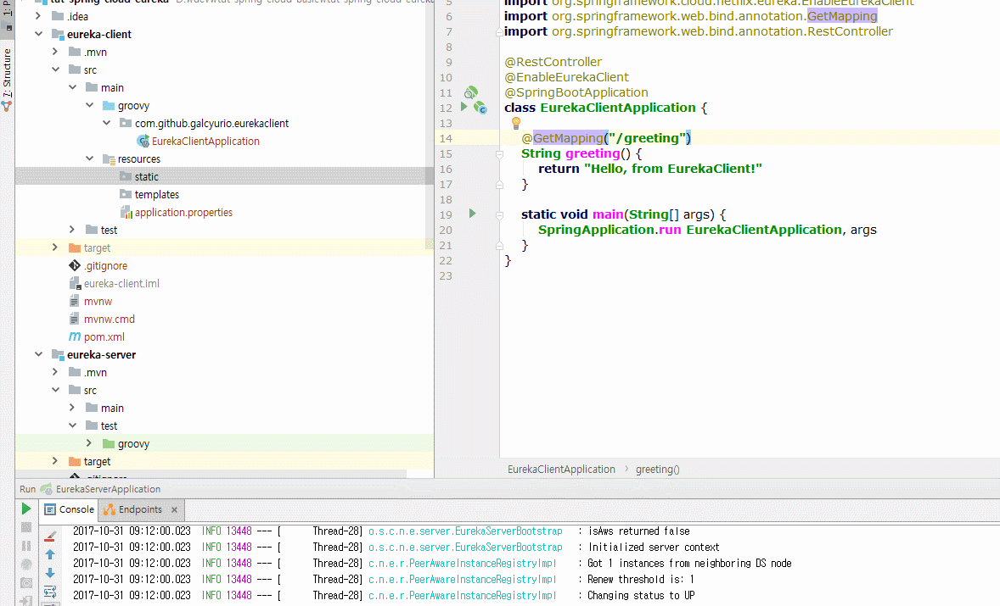

## Issue summary
When I reopen some project which I created 1 day before.  
Intellij IDEA doesn't detect automatically application.properties file and ApplicationContext class.  

## Environment (integrated library, OS, etc)
- IntelliJ IDEA 2017.2 Build #IU-172.3317.76, built on July 15, 2017
- Maven project
- Spring 1.5.8.REALEASE
- multiple module architecture

## Expected behavior
just detect ApplicationContext class and .properties, or .yml file automatically.  

## Actual behavior
auto detection not working

## Issue detail (Reproduction steps, use case)
Sorry, I cannot find reproduction steps...

## Trouble shooting
1. We can add ApplicationContext class like following.  
 Project structure -> right click module -> select Spring -> Add -> __select class__ or if you can't see any ApplicationContext class __click add code based configurations and add class manullay__

1. We can import __.properties__ or __.yml__ file using __Customize Spring Boot icon__. However if this icon is disabled, we should find another solution.  
Enable =   
Disable = 

1. Move .properties file to another path, and move to original path again.  

I hope this post helps your trouble.